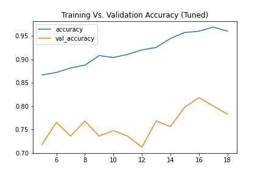

# Clothing classifier using CNN

Building custom **CNN** along with Augmentation (learning purposes) for clothing classification with step by step explanation and a project presentation.

## Overview
Clothing classifier is one of the common classification problems in Machine Learning, one of the most common datasets is the **[Fashion-MNIST dataset](https://github.com/zalandoresearch/fashion-mnist)**, but it's not limited to it, they're many many different resources as well. 

## Problem Statement
Assume that we would like to create a clothing type classifier. You are required to select one of the freely available datasets and create an initial model to deliver a prototype of the solution.

## Project Workflow

1. **Data Acquisition**, finding proper source.
2. **Data Preparation**, problems with raw data and how to resolve it.
3. **Model development**, building a custom CNN model as a baseline.
4. **Model Tuning & Data Augmentation**, tuning model to be more generalized and increasing our data capacity as well.
5. **Evaluation**, showing final evaluation metric results.

## 1) Data Acquisition

---
There are multiple sources for clothing data, use whichever source you like (the model isn't hard coded). Our data source for this project will be **[Clothing Dataset - offered by Alexey Grigorev](https://github.com/alexeygrigorev/clothing-dataset-small)** since it meets the basic requirements.

## 2) Data Preparation

---
Raw data have multiple problems which need to be resolved before feeding it to the CNN, some of them are:
1. **Diiferent image sizes,** neural networks are all about dimensions, having this variety will make the network fail to compute. *that's why all the images are resized to be of **constant size** with proper (yet not too small) resolution.*

2. **Colored images,** coloring helps in identifying and classifying objects in many problems, *unfortunately* not in this one, a white shirt is exactly like a black shirt, coloring is not a vital feature for identifying the cloth type. *That's why all the image data are read in **`grayscale`** format.*

### Data Splitting
Image data is splitted into:
1. Training images (3068 image) ~ 80% of the data.
2. Validation images (341 image) ~ 10% of the data.
3. Test images (372 image) ~ 10% of the data.

## 3) Model development

---
A custom convolutional neural networs is used for this task (**[many optimal different solutions are online](https://www.google.com/)**). Having a custom net comes at the merit of visualising yourself the effect of each layer, each neuron, and each value you use at the cost of tremendous Trying and error approach. *Enjoy every journey as long as you learn*.

### Model architecture

## 4) Model Tuning & Data Augmentation

---
Using [ImageDataGenerator](https://www.tensorflow.org/api_docs/python/tf/keras/preprocessing/image/ImageDataGenerator) by `Tensorflow` we can increase our data by performing image processing operations (e.g: horizontal flip, vertical flip, brigthness adjust, zooming, ..etc.) all are *project dependent*.

To increase and tune our model the following techniques are used:

1. Fewer dropout value to enhace learning the augmented highly variant data.
2. Data image augmentation (using `zoom_range` parameter only). *Note: zooming is not the only/optimal solution, but it validates the augmentation goal* 

## 5) Evaluation

---
Our model test (before tuning) **accuracy** was **75%**, but after tuning and augmenting our data the test accuracy jumped to **78%**. 

### Accuracy plot

# Project Presentation 
To see the Project Presentation click [here](https://bit.ly/3nhqiyI).

# Acknowledgments
- [Andrew Ng Deep learning Specialziation](https://www.coursera.org/specializations/deep-learning?utm_source=gg&utm_medium=sem&utm_campaign=17-DeepLearning-ROW&utm_content=B2C&campaignid=6465471773&adgroupid=76541824319&device=c&keyword=certificate%20in%20deep%20learning&matchtype=b&network=g&devicemodel=&adpostion=&creativeid=379493133118&hide_mobile_promo&gclid=CjwKCAjwwdWVBhA4EiwAjcYJEPGZOBcaQHawPZFGUI9KYGO5tcVI0cV26bJdJlhNjrrNq-LQApzM1xoCf9MQAvD_BwE)
- [Alexey Grigorev - Dataset Provider](https://github.com/alexeygrigorev)
